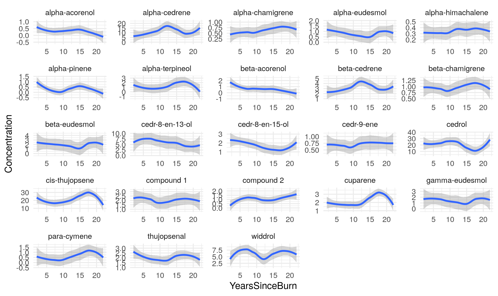

```{r setup, include = FALSE}
knitr::opts_chunk$set(echo = TRUE, cache = TRUE, warning = FALSE, message = FALSE)

```

```{r, echo = FALSE}
# load all necessary libraries within this code chunk 
library(tidyverse)
library(broom)
library(janitor)
library(reactable)

# converts all numbers to standard notation 
options(scipen = 999)

```

# **Faculty Salaries Data** 
## Tidying Data Frame 
For the initial portion of this exam, we must read in and tidy our faculty salaries data to a format in which we can more easily read and utilize. The original file being examined is titled "FacultySalaries_1995.csv". It contains college faculty salaries, total compensation, and faculty count from 1995, by Ranks, Tier, and State.

- **Rank** 
  - Refers to faculty rank: Assistant (not tenured), Associate (tenured), and Full (been around for a long time) professorships 
    - Unsure as to what 'All' is referring to within this context  
- **Tier** 
  - Refers to amount of funding dedicated to research vs. teaching 
    - Tier I = universities that spend more on research than teaching, and also award PhD degrees 

Below is a view of how the data is formatted in the raw data frame and the structure of its data types before we make any changes: 

```{r, echo = FALSE}
# read in data frame 
faculty_dat <- read.csv("FacultySalaries_1995.csv")

# view a portion of the data 
head(faculty_dat)

# verify data structure
str(faculty_dat)

```

A bit unpleasant to the eye, no? Let's fix that! We will now work on cleaning the data to a preferred long format fit for our needs. 
  
- Comments within the code add context to what and why we are doing what we are doing 

```{r, results = 'hide'}
# fixes the column names so they are in Snake Case notation 
clean_faculty_dat <- clean_names(faculty_dat) |>
  select(-num_instructors) # we will not be needing this value so remove it; especially since it will simply have NA values for salary and compensation 

# converts the data into long format 
clean_long_fac_dat <- clean_faculty_dat |>
  pivot_longer(
    cols = starts_with("avg_") | starts_with("num_"),  # include all salary, compensation, and faculty count columns
    names_to = "faculty_info",      # create a column for the faculty information (salary, compensation, etc.)
    values_to = "info_value") |>    # store the values (salary, compensation, etc.)
  mutate(
    faculty_rank = case_when(
      grepl("full_prof", faculty_info) ~ "Full",
      grepl("assoc_prof", faculty_info) ~ "Associate",
      grepl("assist_prof", faculty_info) ~ "Assistant",
      grepl("_all", faculty_info) ~ "All",  # this covers the "avg_prof_salary_all" and "num_faculty_all"
      TRUE ~ NA_character_
    ),
    info_type = case_when(
      grepl("salary", faculty_info) ~ "Salary",
      grepl("comp", faculty_info) ~ "Compensation",
      grepl("num", faculty_info) ~ "Faculty Count",
      TRUE ~ NA_character_
    )
  ) |>
  select(-faculty_info)  # remove the original "faculty_info" column to clean up the data

# rearrange the columns, change the data types, and add a unique id column 
tidy_dat <- clean_long_fac_dat |>
  select(fed_id, univ_name, state, tier, faculty_rank, info_type, info_value) |>
  mutate(row_id = row_number(), # add a key column `row_id` starting from 1
         tier = as.factor(tier), # change these 3 categorical columns into factors 
         faculty_rank = as.factor(faculty_rank),  
         info_type = as.factor(info_type)) |> 
  select(row_id, everything()) 

# examine data structure 
str(tidy_dat)

```

The following is a portion of the data we have now cleaned up for reference as well as the new data structure: 

```{r, echo = FALSE}
# the first 6 rows of our data frame 
head(tidy_dat, 12)

# view the new data structure 
str(tidy_dat)

```

## Re-creating Graph 
As described in the assignment, we want to re-create the following graph: 

```{r, echo = FALSE}
# demonstrates the reference graph we wish to re-create 
knitr::include_graphics("Fig1.png")

```

We want to create a faceted box plot that demonstrates the correlation between school tier, faculty rank, and faculty salary. Here is the code that accomplishes that re-creation along with the produced graph: 

```{r}
# filter for salary data and exclude tier VIIB and faculty_rank "All"
salary_data <- tidy_dat |> 
  filter(info_type == "Salary") |>  # keep only salary data
  filter(tier != "VIIB") |>         # exclude tier VIIB
  filter(faculty_rank != "All")     # exclude faculty rank "All"

# creating the faceted box plot 
salary_box_plot <- salary_data |> 
  ggplot(aes(x = faculty_rank, y = info_value, fill = faculty_rank)) +
  geom_boxplot() +  # create a box plot 
  facet_wrap(~ tier, scales = "free_x") +  # facet by school tier, with free x-axis
  labs(
    title = "Faculty Salary Distribution by School Tier and Faculty Rank",
    x = "Rank",
    y = "Salary"
  ) +
  scale_fill_discrete(name = "Rank") +  # change the legend title to "Rank"
  theme_minimal() +
  theme(
    axis.text.x = element_text(angle = 45, hjust = 1) # rotate x-axis labels by 45 degrees
  )

# view the completed box plot 
print(salary_box_plot)

```

As you can see, there are some subtle differences in formatting such as a less condensed graph and an included title, but I figured I would just make it look nice like this! 

  - the graph still shows the exact same thing in the exact same way 
  
## Building an ANOVA Model

To conclude our work with the faculties salary data, we want to build an ANOVA model that tests the influence of “State”, “Tier”, and “Rank” on “Salary” but should NOT include any interactions between those predictors.

- ANOVA (Analysis of Variance) is a way to statistically compare 3 or more independent groups. It is used to determine if there's a difference between groups.

The following code performs the statistical analysis and outputs the ANOVA model summary: 

```{r}
# ANOVA models require at least 3 categorical groups for effective usage, therefore, we have to change the state data type 
anova_salary_data <- salary_data |>
  mutate(state = as.factor(state)) # change state data type from chr to factor 

# perform an ANOVA model
anova_model <- aov(info_value ~ state + tier + faculty_rank, data = anova_salary_data)
# using anova_salary_data as it is already formatted to exclude the "All" faculty rank and other info_values
# I also removed the VIIB school tier as it is so minimally important there was no reason to include it 

# summarize the ANOVA model 
summary(anova_model)

```

Because I'm a bit extra, the following code cleans up the ANOVA model summary and formats it into a reactable just so it is nicer to look at! 

```{r}
# tidy the ANOVA model summary 
anova_summary <- broom::tidy(anova_model) # converts model outputs into tidy data frames 

# create a reactable to display the ANOVA summary in a nicer format 
reactable(
  anova_summary,
  columns = list(
    term = colDef(name = "Term", minWidth = 150),
    df = colDef(name = "Degrees of Freedom", align = "center"),
    sumsq = colDef(name = "Sum of Squares", format = colFormat(digits = 2)),
    meansq = colDef(name = "Mean Square", format = colFormat(digits = 2)),
    statistic = colDef(name = "F-Value", format = colFormat(digits = 2)),
    p.value = colDef(
      name = "P-Value",
      cell = function(value) {
        if (is.na(value)) {
          "NA"
        } else if (value < 0.001) {
          "<0.001"
        } else {
          format(value, digits = 3)
        }
      },
      align = "center"
    )
  ),
  bordered = TRUE,
  highlight = TRUE,
  defaultPageSize = 5
)

```

# **Juniper Oils Data**
## Tidying Data Frame 
For the second part of this exam, we will be investigating "Juniper_Oils.csv", a data set compiled in a collaborative effort between Young Living Inc. and UVU Microbiology which studied the chemical composition of essential oil content within dead cedar trees.

- Hypothesis: certain chemicals would degrade over time as a result of death by burning 

The data set contains many columns, including a column titled "YearsSinceBurn." **There is a large group of columns that refer to chemicals whose values are Mass-Spec concentrations.** These are the columns we are to focus on for the sake of this exam. 

- We have also been provided a nicely formatted list of the chemical compounds for our use: 

```{r, results = 'hide'}
c("alpha-pinene","para-cymene","alpha-terpineol","cedr-9-ene","alpha-cedrene","beta-cedrene","cis-thujopsene","alpha-himachalene","beta-chamigrene","cuparene","compound 1","alpha-chamigrene","widdrol","cedrol","beta-acorenol","alpha-acorenol","gamma-eudesmol","beta-eudesmol","alpha-eudesmol","cedr-8-en-13-ol","cedr-8-en-15-ol","compound 2","thujopsenal")

```

Below is a view of how the data is formatted in the raw data frame and the structure of its data types before we make any changes: 

```{r, echo = FALSE}
# read in data frame 
juniper_dat <- read.csv("Juniper_Oils.csv")

# view a portion of the data 
head(juniper_dat)

# verify data structure
str(juniper_dat)

```

This data frame is a bit difficult to discern and quite overwhelming in its current state. This is what we will be cleaning up into a clearer and more usable format! Below is the code for both cleaning our data and a demonstration of the data structure itself. 

- Comments within the code add context to what and why we are doing what we are doing 

```{r}
# convert column names to snake_case 
clean_names_juniper <- clean_names(juniper_dat)

# select only necessary columns for our analysis 
only_important_juniper <- clean_names_juniper |>
  select(sample_id, tree_species, burn_year, years_since_burn, alpha_pinene:thujopsenal)

# convert the data to long format 
tidy_juniper_dat <- only_important_juniper |>
  pivot_longer(cols = alpha_pinene:thujopsenal,
               names_to = "chemical_id",
               values_to = "mass_spec_concentrations") |>
  mutate(chemical_id = as.factor(chemical_id), # convert the chemical_id column to a fct data type
         row_id = row_number()) |> # create a key column just in case ;)
  relocate(row_id, .before = everything()) 

# a portion of our newly cleaned data 
head(tidy_juniper_dat)

# a look into the updated data structure itself 
str(tidy_juniper_dat)

```

## Re-creating Graph
As described in the assignment description, we want to build a graph that demonstrates the decrease (if any) of the different chemical concentrations years after the trees were burned. Here are the parameters we want to follow: 

    x = years_since_burn
    y = mass_spec_concentrations
    facet = chemical_id (use free y-axis scales)

Here is the graph example given to us to try to re-create: 

```{r, echo = FALSE}
# demonstrates the reference graph we wish to re-create 


```

Here is the code that accomplishes the task of creating the graph along with the produced graph itself: 

```{r}
# create a smooth line graph with standard error shading
juniper_line_graph <- tidy_juniper_dat |>
  ggplot(aes(x = years_since_burn, y = mass_spec_concentrations)) +
  geom_smooth(color = "red") +
  facet_wrap(~chemical_id, scales = "free_y") +  # facet by chemical_id with free y-axis scales
  theme_minimal() + 
  labs(
    title = "Mass-Spec Concentrations by Years Since Burn",
    x = "Years Since Burn",
    y = "Concentration",
    caption = "Data: Juniper Tree Chemical Concentrations"
  )

# print the graph
juniper_line_graph

```

## Building a Generalized Linear Model 
For the very last portion of this exam, we want to use a generalized linear model to find which chemicals show concentrations that are significantly (P-value < 0.05) affected by “Years Since Burn”. Using the tidy() function from the Broom package, we will produce a data frame that show **only** the important and necessary summary statistics for this analysis. 

The following code produces the generalized linear model results of only the **significant** terms: 

```{r}
# fit a generalized linear model for each chemical_id and extract significant results
significant_chemicals <- tidy_juniper_dat |>
  group_by(chemical_id) |>
  nest() |>
  mutate(
    model = map(data, ~ glm(mass_spec_concentrations ~ years_since_burn, data = .x)),
    model_output = map(model, tidy) # using the tidy function from the Broom package 
  ) |>
  unnest(model_output) |>
  filter(term == "years_since_burn" & p.value < 0.05) |>  # focus on "Years Since Burn" term
  select(chemical_id, estimate, std.error, statistic, p.value)

# view the significant chemicals
significant_chemicals

```
